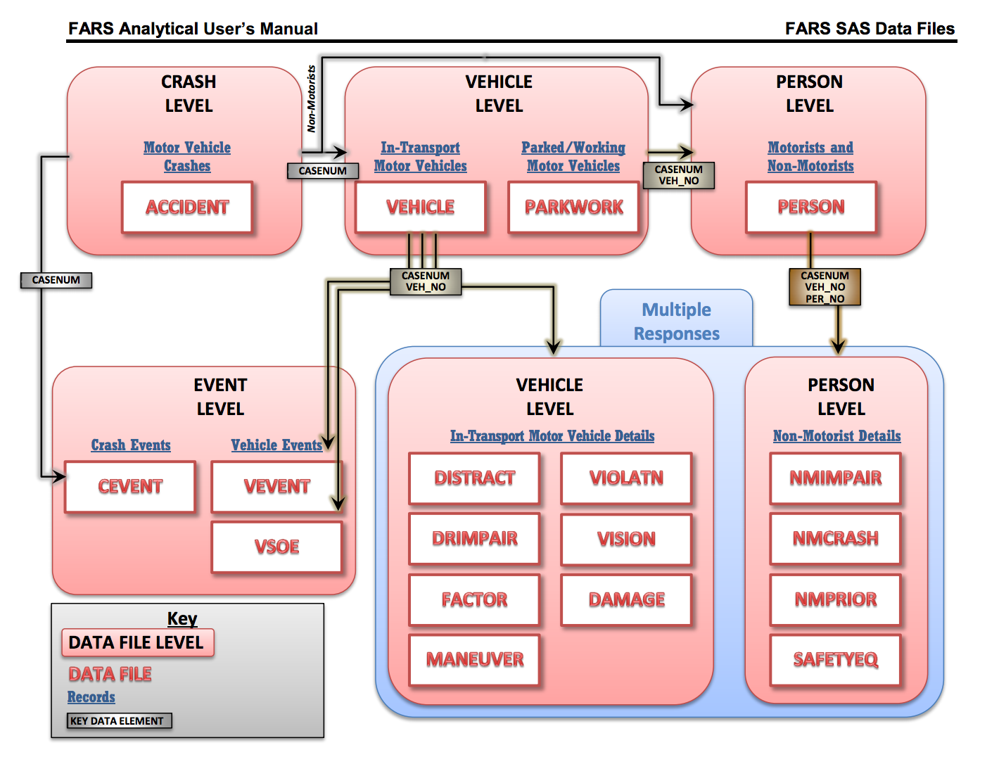
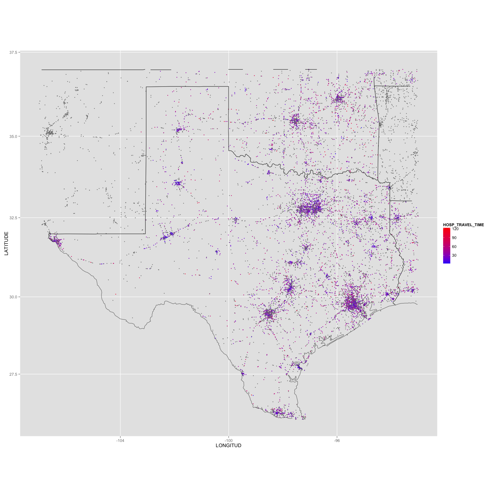
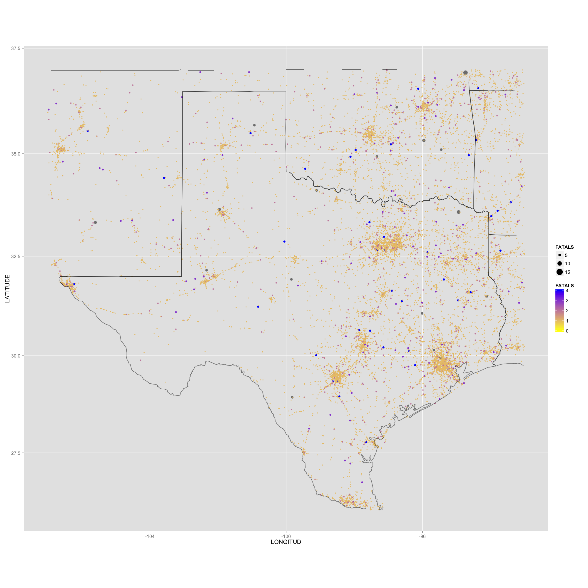
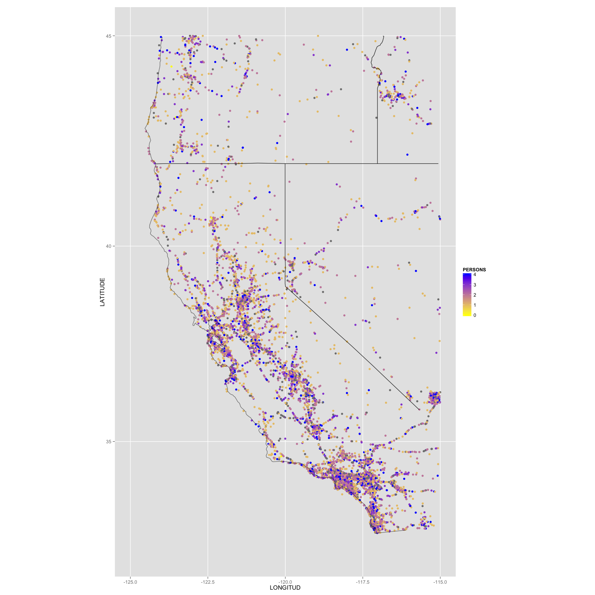

Data Science Fall 2014 R Project
===
**This project analyzes the accidents data from the ggplot2 package which has been supplemented with additional synthetic data and stored in an Oracle database.**

###This is how my RStudio is configured:
```{r}
sessionInfo()
```

###These are the packages I load from .Rprofile:
```{r}
# To get this to work in your environment, change the following directory/folder path to the path to your project files.
setwd("/Users/brandon/Dropbox/Programming/School/Data-Science/Our-Project/RProject/")
system("cat .Rprofile", intern = TRUE)
```

###Accidents Data Model

  

###Accidents Data 

####First Few Rows of Accident.dml

```{r}
# To get this to work in your environment, change the following directory/folder path to the path to your project files.
setwd("/Users/brandon/Dropbox/Programming/School/Data-Science/Our-Project/RProject/03Analysis/")
system("head accident.dml.head", intern = TRUE)
``` 

```{r}
source("~/Dropbox/Programming/School/Data-Science/Our-Project/RProject/03Analysis/AccidentAnalysis.R", echo = TRUE)
```

### Hospital Travel Time

  


### Occupants and Fatalities (Texas)

  

### Occupants (California)




