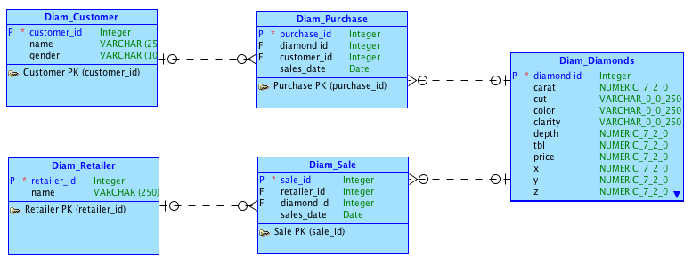

Data Science Fall 2014 R Project
===
**This project analyzes the Diamonds data from the ggplot2 package which has been supplemented with additional synthetic data and stored in an Oracle database.**

###This is how my RStudio is configured:
```{r}
sessionInfo()
```

###These are the packages I load from .Rprofile:
```{r}
# To get this to work in your environment, change the following directory/folder path to the path to your project files.
setwd("~/Mine/UT/GitRepositories/DataScienceFall2014/RProject")
system("cat .Rprofile", intern = TRUE)
```

###Diamonds Data Model

  

###Diamonds Data 

####Diamonds.ddl 

```{r}
# To get this to work in your environment, change the following directory/folder path to the path to your project files.
setwd("~/Mine/UT/GitRepositories/DataScienceFall2014/RProject/02 Diamonds Data")
system("cat Diamonds.ddl", intern = TRUE)
``` 

####First few rows of Diamonds.dml

```{r}
# To get this to work in your environment, change the following directory/folder path to the path to your project files.
setwd("~/Mine/UT/GitRepositories/DataScienceFall2014/RProject/02 Diamonds Data")
system("head Diamonds.dml", intern = TRUE)
``` 

####Python script to generate synthetic Diamonds data.

```{r, tidy=TRUE}
# To get this to work in your environment, change the following directory/folder path to the path to your project files.
setwd("~/Mine/UT/GitRepositories/DataScienceFall2014/RProject/02 Diamonds Data")
# I can't get this to print out properly so I've commented it out for now.
#system("cat fakeDiamondsData.py", intern = TRUE)
``` 

####DiamondsRest.ddl 

```{r}
# To get this to work in your environment, change the following directory/folder path to the path to your project files.
setwd("~/Mine/UT/GitRepositories/DataScienceFall2014/RProject/02 Diamonds Data")
system("cat DiamondsRest.ddl", intern = TRUE)
``` 

####First few rows of fakeDiamondsData.dml

```{r}
# To get this to work in your environment, change the following directory/folder path to the path to your project files.
setwd("~/Mine/UT/GitRepositories/DataScienceFall2014/RProject/02 Diamonds Data")
system("head fakeDiamondsData.dml", intern = TRUE)
``` 

```{r}
source("../03 Analysis/Diamonds Analysis.R", echo = TRUE)
```